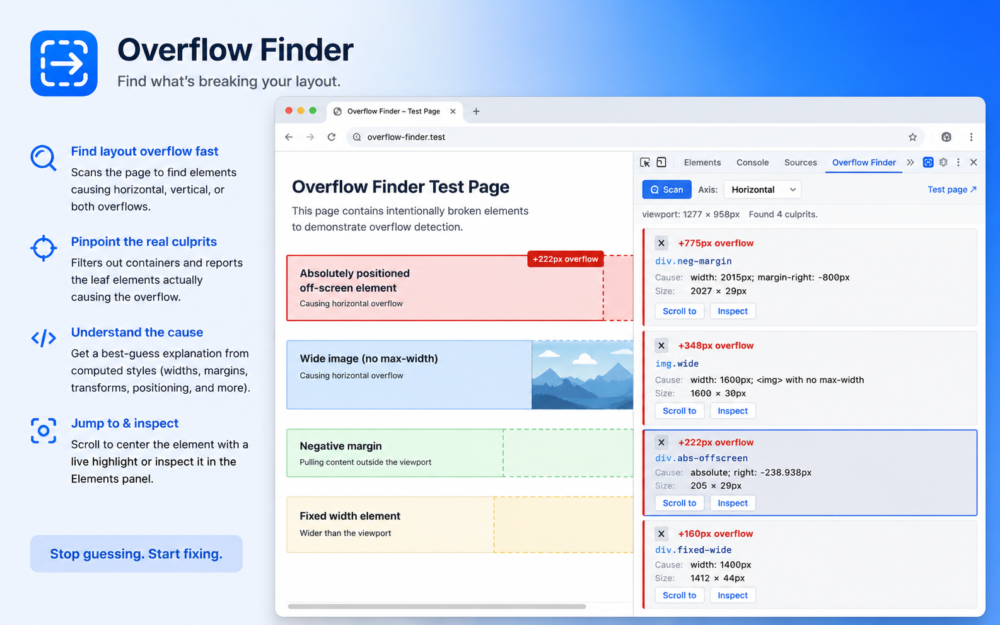
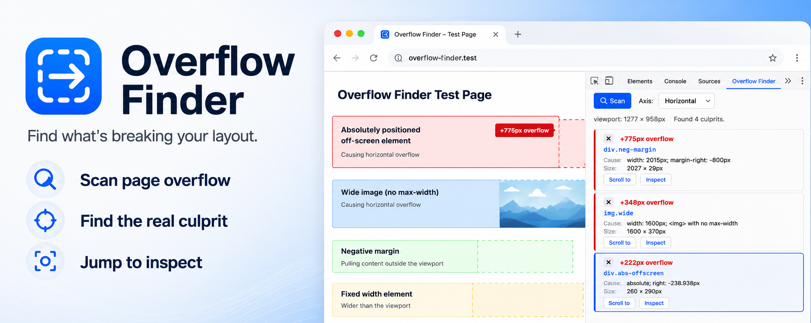

# Overflow Finder

<p align="center">
  
</p>

A Chrome DevTools extension that finds the elements causing horizontal (or vertical) overflow on a page — without you deleting nodes one by one in the Elements panel to bisect.

Adds an **Overflow Finder** tab to DevTools. Click **Scan** and you get a ranked list of culprits with the likely cause for each (`width: 1400px`, `white-space: nowrap`, `translateX(600px)`, …). Hover a card to highlight the element on the page; click to select it in the Elements panel; click **Delete** on a card to remove the element from the DOM (you can restore it after).

## Install (unpacked)

```bash
git clone https://github.com/IsItGreg/overflow-finder-extension.git
```

1. Open `chrome://extensions`.
2. Toggle **Developer mode** on (top right).
3. Click **Load unpacked**.
4. Select the cloned repo's directory (`overflow-finder-extension/`).
5. Open any page → open DevTools → **Overflow Finder** tab → click **Scan**.

To verify the install works, click the **Test page ↗** link in the top-right of the Overflow Finder panel — it opens the bundled `test/fixtures.html` in a new tab. Resize the window to ~375px wide and run a scan. You should see ~10 culprits with axis labels, sizes, and likely causes.

## How it works

<p align="center">
  
</p>

The panel injects a small script into the inspected page via `chrome.devtools.inspectedWindow.eval`. The script walks the DOM (descending into open shadow roots), collects every element whose bounding box passes the viewport edge, drops anything contained by an `overflow: hidden|auto|scroll|clip` ancestor that's itself within the viewport, and then keeps only "leaf" culprits — if a candidate has a culprit descendant, the descendant is the real source. Each remaining culprit is annotated with a likely cause guessed from computed style.

Element references stay in the page (`window.__overflowFinder.lastResults`); only serializable metadata crosses back to the panel. Selecting an element calls `inspect()` from inside the page eval so the Elements panel jumps to it. Deleting a card stashes the element's parent and next-sibling so it can be reinserted at its original position.

## Limitations / not in MVP

- **Top-level frame only** — iframe content is not scanned.
- **Scan-on-demand** — no live re-scan as the page changes; click Scan again after a resize or DOM mutation.
- **Chrome / Chromium only** — Edge and Brave install Chrome extensions unchanged. Firefox port is deferred (similar API surface, slightly different namespace).
- The "likely cause" heuristics are best-effort. If none match, you'll see `unknown` — the rect and the Elements-panel selection will still help you narrow it down.

## File layout

```
.
├── manifest.json     # MV3, declares devtools_page
├── devtools.html     # Entry shim that loads devtools.js
├── devtools.js       # Registers the Overflow Finder panel
├── panel.html        # Panel UI shell
├── panel.js          # Scan trigger, list rendering, hover/click handlers
├── panel.css         # Styling (auto dark/light)
├── icons/            # 16/32/48/128 PNG icons
├── inject/
│   ├── scan.js       # Detection algorithm — eval'd into the inspected page
│   └── overlay.js    # On-page highlight box — eval'd into the inspected page
└── test/
    └── fixtures.html # Sample page with planted culprits for manual testing
```

## Privacy

Overflow Finder collects no data, sends no telemetry, and makes no network requests. All scanning happens locally inside your DevTools session — element references and metadata never leave the page.

## License

MIT — see [LICENSE](LICENSE).
